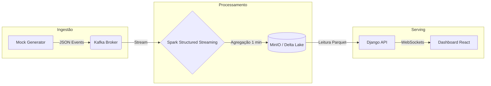

Aqui está o arquivo `README.md` completo, profissional e formatado para o seu portfólio. Ele documenta toda a arquitetura que construímos, desde a ingestão até a API.

Você pode copiar o código abaixo e salvar como `README.md` na raiz do projeto.


# 🛒 Real-Time Analytics Hub

> **Arquitetura de Referência para Engenharia de Dados em Tempo Real** > Processamento de transações de e-commerce com Apache Spark Streaming, Kafka, Delta Lake e Django.


---

## 🏗️ Arquitetura do Sistema

O projeto simula um ecossistema de dados de alta performance, capaz de ingerir, processar e servir dados de vendas em tempo real.



## 🚀 Funcionalidades

### 1. Ingestão de Dados (Mock Generator)

* Simula transações de múltiplas plataformas (Amazon, Mercado Livre, Shopee).
* Gera eventos estocásticos de **Vendas**, **Atualizações de Estoque** e **Visualizações**.
* Publica mensagens em formato JSON no tópico `ecommerce-events` do Kafka.

### 2. Processamento em Stream (Spark Jobs)

* **Engine:** Apache Spark 3.5 com Delta Lake 3.0.
* **Job de Agregação:** Calcula a receita total por plataforma em janelas deslizantes de 1 minuto.
* **Job de Alertas:** Detecta estoque crítico (< 10 unidades) e vendas de alto valor (High Ticket) em tempo real.
* **Checkpoints:** Garante tolerância a falhas e processamento *exactly-once*.

### 3. Data Lakehouse (MinIO + Delta Lake)

* Armazenamento de dados brutos e processados em formato **Parquet/Delta**.
* Suporte a *Time Travel* e transações ACID.
* Estrutura de pastas particionada para otimização de leitura.

### 4. Backend & API (Django)

* **Leitura de Data Lake:** Serviço customizado para ler arquivos Parquet diretamente do MinIO.
* **API REST:** Endpoints para consulta de métricas consolidadas.
* **WebSockets:** Implementação com Django Channels para push de atualizações ao frontend.

---

## 🛠️ Stack Tecnológica

| Componente | Tecnologia | Versão | Descrição |
| --- | --- | --- | --- |
| **Linguagem** | Python | 3.12 | Base de todos os serviços (uv workspace). |
| **Broker** | Apache Kafka | 7.6 | Backbone de mensageria da Confluent. |
| **Engine** | PySpark | 3.5.0 | Processamento distribuído e Streaming. |
| **Storage** | MinIO | Latest | Object Storage compatível com S3. |
| **Formato** | Delta Lake | 3.0.0 | Camada de armazenamento open table. |
| **Backend** | Django | 5.0 | Framework Web e API. |
| **Infra** | Docker | Compose | Orquestração de containers local. |

---

## ⚙️ Como Rodar o Projeto

### Pré-requisitos

* Docker e Docker Compose instalados.
* Gerenciador de pacotes `uv` (opcional, para desenvolvimento local).

### Passo 1: Subir a Infraestrutura

Na raiz do projeto, execute:

```bash
docker-compose up -d --build

```

*Isso iniciará o Kafka, Zookeeper, MinIO, Postgres, Redis, Spark Master/Worker e a API Django.*

### Passo 2: Iniciar o Job do Spark

O cluster Spark sobe em modo "Standby". Para iniciar o processamento do stream:

1. Acesse o container do Worker:
```bash
docker exec -it ecommerce_spark_worker bash

```


2. Submeta o job de agregação:
```bash
/opt/bitnami/spark/bin/spark-submit \
--packages org.apache.spark:spark-sql-kafka-0-10_2.12:3.5.0,io.delta:delta-spark_2.12:3.0.0,org.apache.hadoop:hadoop-aws:3.3.4 \
--master spark://spark-master:7077 \
/opt/spark-jobs/streaming_sales_agg.py

```


### Passo 3: Acessar os Serviços

| Serviço | URL | Credenciais (Padrão) |
| --- | --- | --- |
| **MinIO Console** | http://localhost:9001 | `minioadmin` / `minioadmin` |
| **Spark Master UI** | http://localhost:8080 | - |
| **API Health Check** | http://localhost:8000/api/health/ | - |
| **Django Admin** | http://localhost:8000/admin/ | (Requer `createsuperuser`) |

---

## 📂 Estrutura do Repositório (Monorepo)

```text
realtime-analytics-hub/
├── backend/                # API Django e Consumers
│   ├── api/                # Apps e Lógica de Negócio
│   ├── config/             # Configurações do Projeto (settings, asgi)
│   └── services/           # Leitores do Delta Lake
├── mock-generator/         # Gerador de dados fake (Producer)
│   ├── platforms/          # Lógica específica de cada e-commerce
│   └── generator.py        # Script principal
├── spark-jobs/             # Scripts PySpark (Processor)
│   ├── streaming_sales_agg.py
│   └── alert_detection.py
├── docker-compose.yml      # Orquestração
├── pyproject.toml          # Definição do Workspace UV
└── README.md               # Documentação

```

## 🐛 Troubleshooting Comum

**O Spark não salva dados no MinIO?**

* Verifique se o bucket `delta-lake` foi criado no MinIO (http://localhost:9001).
* Confirme se as credenciais no `.env` são `minioadmin`.

**Erro de Offset no Kafka?**

* Se reiniciar o cluster, o Spark pode tentar ler offsets antigos. Altere a opção `.option("startingOffsets", "earliest")` no script Python.

---

Desenvolvido por **Paulo Arruda**.

```